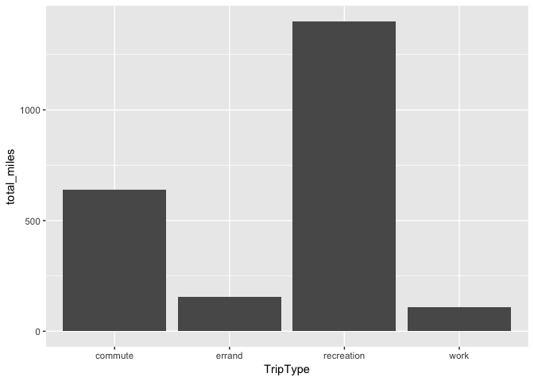
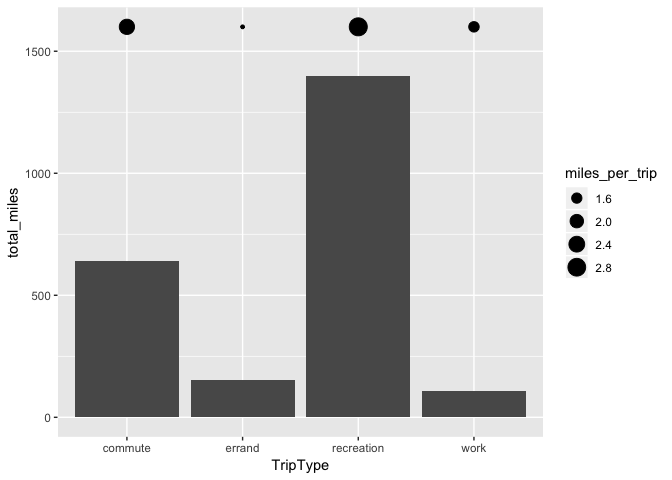
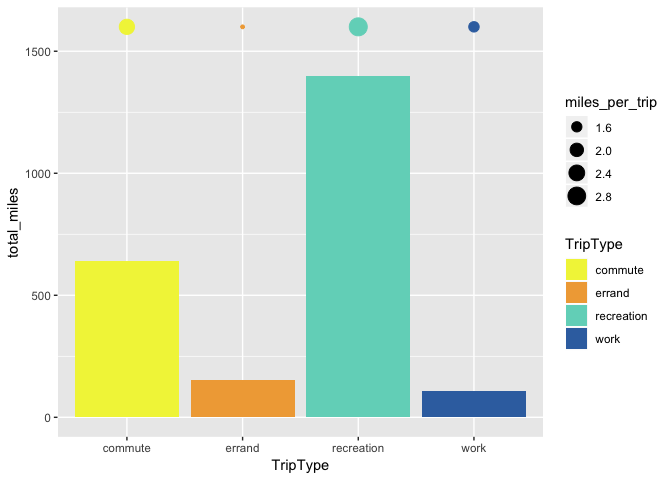
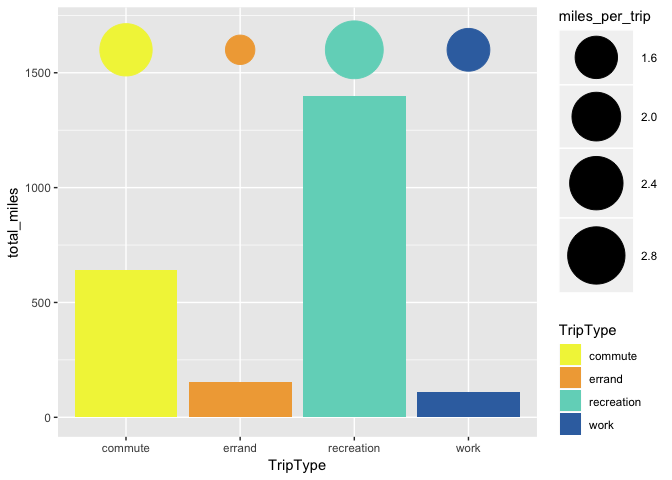
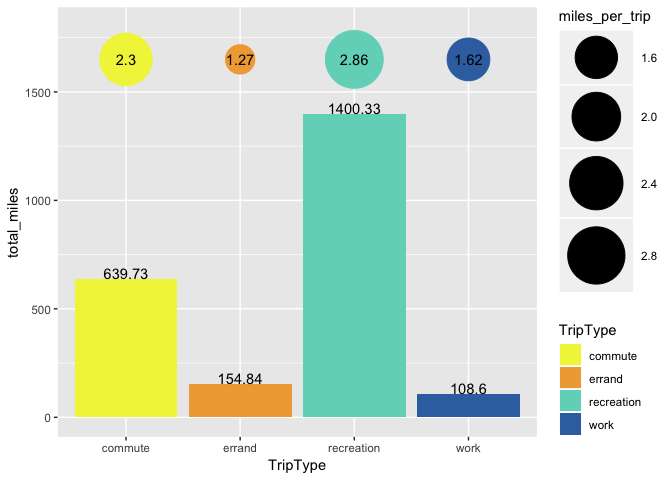
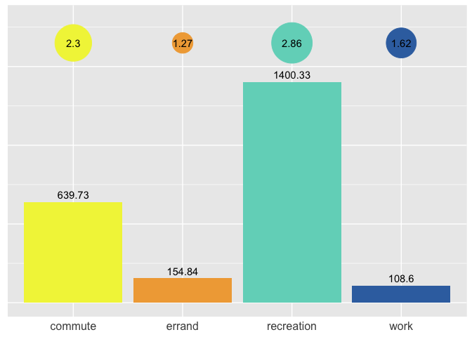
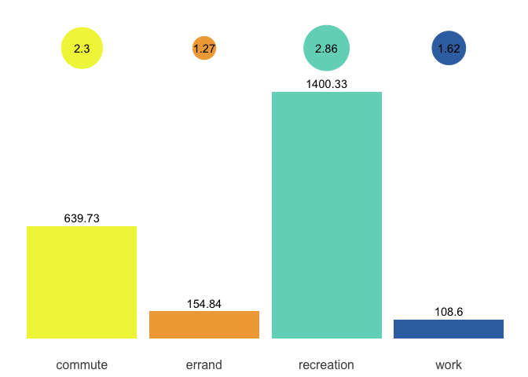

### \#TidyTuesday - Week 10 data

The data for week 10 can be found
[here](https://github.com/rfordatascience/tidytuesday/tree/master/data/2018-06-05).
It’s bike share data from Portland.

First, we need to set the package we are using with library(). This
dataset was a little more difficult to read in because there are times
in the “Duration” column with a value of “NA:NA:NANA”. To get around
this, I set the column type for that column to character. The rest of
the columns I let the read\_csv() function figure out itself.

``` r
library(tidyverse)

data <- read_csv("new.week10_biketown.csv", col_types = cols(Duration = col_character()))
```

    ## Warning: Missing column names filled in: 'X1' [1]

``` r
head(data)
```

    ## # A tibble: 6 x 20
    ##      X1 RouteID PaymentPlan StartHub StartLatitude StartLongitude StartDate
    ##   <int>   <int> <chr>       <chr>            <dbl>          <dbl> <chr>    
    ## 1     1 1282087 Casual      NE Sand…          45.5          -123. 7/19/2016
    ## 2     2 1282113 Subscriber  <NA>              45.5          -123. 7/19/2016
    ## 3     3 1282118 Subscriber  NW Kear…          45.5          -123. 7/19/2016
    ## 4     4 1282120 Subscriber  <NA>              45.5          -123. 7/19/2016
    ## 5     5 1282123 Subscriber  <NA>              NA              NA  7/19/2016
    ## 6     6 1282125 Casual      SE 30th…          45.5          -123. 7/19/2016
    ## # ... with 13 more variables: StartTime <time>, EndHub <chr>,
    ## #   EndLatitude <dbl>, EndLongitude <dbl>, EndDate <chr>, EndTime <time>,
    ## #   TripType <chr>, BikeID <int>, BikeName <chr>, Distance_Miles <dbl>,
    ## #   Duration <chr>, RentalAccessPath <chr>, MultipleRental <lgl>

I’d like to look at the distance compared to the type of trip. I’m
thinking about a bar plot showing the total number of miles per trip
with a dot plot that shows the average number of miles for each trip
type.

We’ll start by selecting the columns we need using select(). There are
quite a few NAs in this data. I used drop\_na() to remove all the rows
with NA in them. Next, I want to group the rows by trip type using the
group\_by() function. Then I use summarise() to add the total miles for
each trip type & to count the total number of trips. Next I use mutate
to determine the average number of miles for each type of trip.

``` r
data1 <- data %>%
  select(TripType, Distance_Miles) %>%
  drop_na() %>%
  group_by(TripType) %>%
  summarise(total_miles = sum(Distance_Miles), total_trips = n()) %>%
  mutate(miles_per_trip = (total_miles/total_trips))

head(data1)
```

    ## # A tibble: 4 x 4
    ##   TripType   total_miles total_trips miles_per_trip
    ##   <chr>            <dbl>       <int>          <dbl>
    ## 1 commute           640.         278           2.30
    ## 2 errand            155.         122           1.27
    ## 3 recreation       1400.         490           2.86
    ## 4 work              109.          67           1.62

Now that we have our data, let’s get to work plotting it\! First off,
let’s do a basic bar plot. For this, we use geom\_col() to create the
bar plot.

``` r
ggplot(data1) +
  geom_col(aes(TripType, total_miles))
```

<!-- -->

Not bad, but we can do better\! Let’s add in the dot plot. I want the
point to be above the corresponding bar so we use “TripType” for the x
variable. To make the dot appear above each bar, I started with 1600 on
the y-axis. We can adjust that later as our graphic takes shape. To make
the size of the dot correspond to the average number of miles we use the
size option in our aes() call.

``` r
ggplot(data1) +
  geom_col(aes(TripType, total_miles)) +
  geom_point(aes(TripType, 1600, size=miles_per_trip))
```

<!-- -->

Now we’re getting somewhere\! We have the basic plot. From here, we can
work on making it look better. Let’s start by adding my favorite thing:
color\! This plot is interesting because the color of the bar in
geom\_col() is controlled by fill whilst the color of the dot in
geom\_point() is controlled by color. This means I actually need to
create two color palettes: one for fill using scale\_fill\_manual() &
one for color using scale\_color\_manual().

``` r
ggplot(data1) +
  geom_col(aes(TripType, total_miles, fill=TripType)) +
  geom_point(aes(TripType, 1600, size=miles_per_trip, color=TripType)) +
  scale_fill_manual(values=c("#f1f346", "#f0a944",  "#71d5c3",  "#3870af")) +
  scale_color_manual(values=c("#f1f346",    "#f0a944",  "#71d5c3",  "#3870af"))
```

<!-- -->

Looks better already\! Next I want to work on the size of the dots. I
want them to be bigger so we can understand the data better. Just like
we can change the color scale with scale\_color\_manual(), we can use
scale\_size\_continuous() to change the range of sizes the dot can be. I
played with a few different options before I decided on using a range
from 10-20. To make enough room for the dots, I had to adjust the limits
on the y-axis a bit. I used ylim() to do that. Alternatively, you can
use xlim() to change the limits on the x-axis.

``` r
ggplot(data1) +
  geom_col(aes(TripType, total_miles, fill=TripType)) +
  geom_point(aes(TripType, 1600, size=miles_per_trip, color=TripType)) +
  scale_fill_manual(values=c("#f1f346", "#f0a944", "#71d5c3", "#3870af")) +
  scale_color_manual(values=c("#f1f346", "#f0a944", "#71d5c3", "#3870af")) +
  scale_size_continuous(range = c(10,20)) +
  ylim(c(0,1700))
```

<!-- -->

I’m liking how this looks\! Let’s clean it up a bit. First, I want to
add text labels to both dots & the bars. To do this, we can use
geom\_text().

The first geom\_text() call adds the labels to the bar plot. I set the
vertical justification to 0 using vjust so the labels would sit on top
of the bars.

The second geom\_text() call adds the labels to the dots. For this one,
the calculated numbers have too many decimal places. I used the round
function to cut it down to two decimal places.

I had to adjust the y value for the dots to make room for the new
labels.

``` r
ggplot(data1) +
  geom_col(aes(TripType, total_miles, fill=TripType)) +
  geom_point(aes(TripType, 1650, size=miles_per_trip, color=TripType)) +
  geom_text(aes(TripType, total_miles, label=total_miles), vjust=0) +
  geom_text(aes(TripType, 1650, label = round(miles_per_trip, 2))) +
  scale_fill_manual(values=c("#f1f346", "#f0a944", "#71d5c3", "#3870af")) +
  scale_color_manual(values=c("#f1f346", "#f0a944", "#71d5c3", "#3870af")) +
  scale_size_continuous(range = c(10,20)) +
  ylim(c(0,1800))
```

<!-- -->

We’re starting to get a better looking plot. More clean up is needed\!
Let’s remove the legend because it isn’t doing much for the plot. Using
theme(), I removed the legend. While we’re playing with theme(), lets
change the font size for the x-axis text. I removed the tick marks from
both axes. I removed the axes titles as well. I adjusted the bar plot
label height a bit. It wasn’t looking quite right to me\!

``` r
ggplot(data1) +
  geom_col(aes(TripType, total_miles, fill=TripType)) +
  geom_point(aes(TripType, 1650, size=miles_per_trip, color=TripType)) +
  geom_text(aes(TripType, total_miles, label=total_miles), vjust=-0.5) +
  geom_text(aes(TripType, 1650, label = round(miles_per_trip, 2))) +
  theme(legend.position = "none",
    axis.title = element_blank(),
    axis.text.x = element_text(size=12),
    axis.text.y = element_blank(),
    axis.ticks = element_blank()) +
  scale_fill_manual(values=c("#f1f346", "#f0a944", "#71d5c3", "#3870af")) +
  scale_color_manual(values=c("#f1f346", "#f0a944", "#71d5c3", "#3870af")) +
  scale_size_continuous(range = c(10,20)) +
  ylim(c(0,1800))
```

<!-- -->

A bit more cleaning. I removed the background panel & all the grid
lines.

``` r
ggplot(data1) +
  geom_col(aes(TripType, total_miles, fill=TripType)) +
  geom_point(aes(TripType, 1650, size=miles_per_trip, color=TripType)) +
  geom_text(aes(TripType, total_miles, label=total_miles), vjust=-0.5) +
  geom_text(aes(TripType, 1650, label = round(miles_per_trip, 2))) +
  theme(legend.position = "none",
    axis.title = element_blank(),
    axis.text.x = element_text(size=12),
    axis.text.y = element_blank(),
    axis.ticks = element_blank(),
    panel.grid.major = element_blank(),
    panel.grid.minor = element_blank(),
    panel.border = element_blank(),
    panel.background = element_blank()) +
  scale_fill_manual(values=c("#f1f346", "#f0a944", "#71d5c3", "#3870af")) +
  scale_color_manual(values=c("#f1f346", "#f0a944", "#71d5c3", "#3870af")) +
  scale_size_continuous(range = c(10,20)) +
  ylim(c(0,1800))
```

<!-- -->

I’m going to go ahead & call this plot done\! Informative & pretty\!
Obviously, if I was going to use this I would include a legend to
describe the figure a bit better.

Any thoughts or feedback are always welcome\! You can find me on
[Twitter](https://twitter.com/sapo83).
