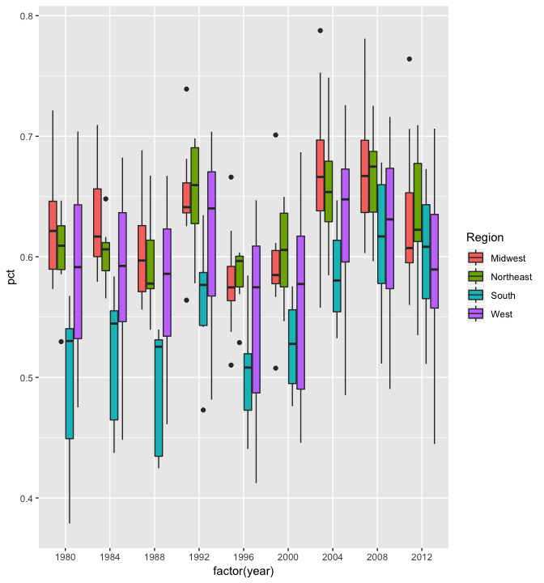
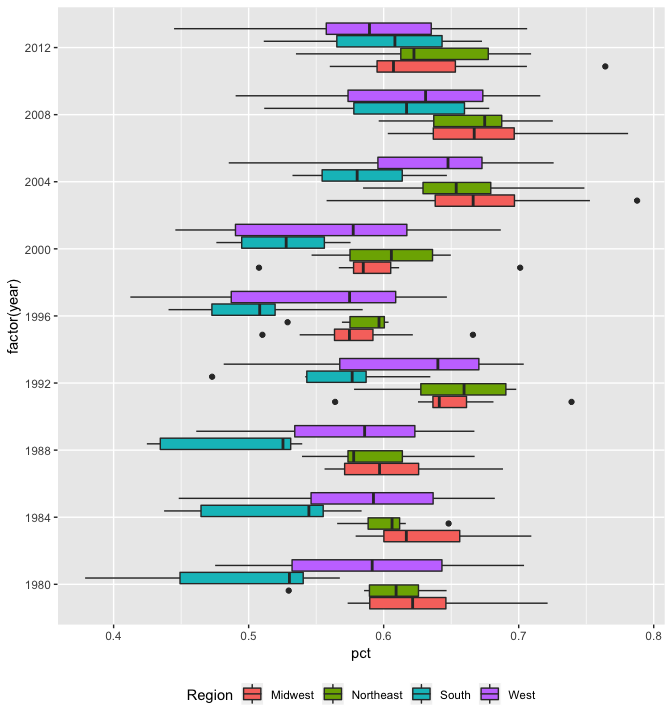
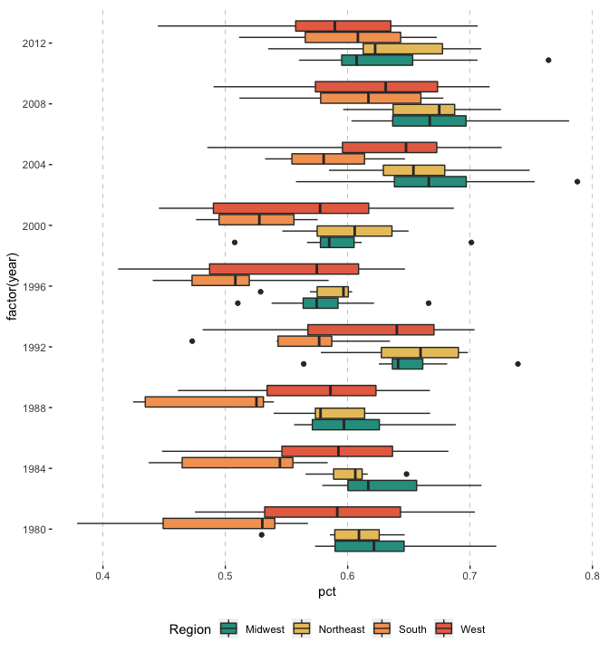
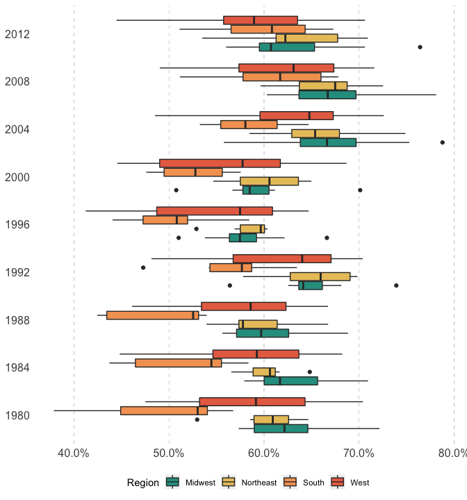

### \#TidyTuesday 10-09-18 Week 28

This week’s data explores voter turnout across the US from 1980 through
2012. The data can be found
[here](https://github.com/rfordatascience/tidytuesday/tree/master/data/2018-10-09).

Today we’re going to do a boxplot visualizing percent of voter turnout
by region for presidential election years.

First, let’s read in our data using `read_csv()`. We’ll use `head()` to
get a look at what we’re working
    with.

``` r
library(tidyverse)
```

    ## ── Attaching packages ────────────────────────────────── tidyverse 1.2.1 ──

    ## ✔ ggplot2 3.0.0     ✔ purrr   0.2.5
    ## ✔ tibble  1.4.2     ✔ dplyr   0.7.6
    ## ✔ tidyr   0.8.1     ✔ stringr 1.3.1
    ## ✔ readr   1.1.1     ✔ forcats 0.3.0

    ## Warning: package 'dplyr' was built under R version 3.5.1

    ## ── Conflicts ───────────────────────────────────── tidyverse_conflicts() ──
    ## ✖ dplyr::filter() masks stats::filter()
    ## ✖ dplyr::lag()    masks stats::lag()

``` r
data <- read_csv("voter_turnout.csv")
```

    ## Warning: Missing column names filled in: 'X1' [1]

    ## Parsed with column specification:
    ## cols(
    ##   X1 = col_integer(),
    ##   year = col_integer(),
    ##   icpsr_state_code = col_integer(),
    ##   alphanumeric_state_code = col_integer(),
    ##   state = col_character(),
    ##   votes = col_integer(),
    ##   eligible_voters = col_integer()
    ## )

``` r
head(data)
```

    ## # A tibble: 6 x 7
    ##      X1  year icpsr_state_code alphanumeric_st… state  votes
    ##   <int> <int>            <int>            <int> <chr>  <int>
    ## 1     1  2014                0                0 Unit… 8.33e7
    ## 2     2  2014               41                1 Alab… 1.19e6
    ## 3     3  2014               81                2 Alas… 2.85e5
    ## 4     4  2014               61                3 Ariz… 1.54e6
    ## 5     5  2014               42                4 Arka… 8.53e5
    ## 6     6  2014               71                5 Cali… 7.51e6
    ## # ... with 1 more variable: eligible_voters <int>

I found a list
[here](https://github.com/cphalpert/census-regions/blob/master/us%20census%20bureau%20regions%20and%20divisions.csv)
that has each of the states & it’s corresponding region & division. For
clarity of the plot later on, I chose to use region instead of division.
There are 4 regions & 9 divisions. 4 regions for each year will be
easier to plot than 9 divisions for each year. Let’s read in the
region/state file & see what we’re working with.

``` r
region_list <- read_csv("state.region.list.csv")
```

    ## Parsed with column specification:
    ## cols(
    ##   State = col_character(),
    ##   `State Code` = col_character(),
    ##   Region = col_character(),
    ##   Division = col_character()
    ## )

``` r
head(region_list)
```

    ## # A tibble: 6 x 4
    ##   State      `State Code` Region Division          
    ##   <chr>      <chr>        <chr>  <chr>             
    ## 1 Alaska     AK           West   Pacific           
    ## 2 Alabama    AL           South  East South Central
    ## 3 Arkansas   AR           South  West South Central
    ## 4 Arizona    AZ           West   Mountain          
    ## 5 California CA           West   Pacific           
    ## 6 Colorado   CO           West   Mountain

Before we start manipulating our data frame, we need to establish which
years a presidential election was held. We can use the command below to
create a list of presidential election years.

``` r
president_years <- seq(1980, 2012, 4)
```

Now let’s work on cleaning up our data frame. First, we’re going to use
`filter()` to keep only the years when a presidential election was held.
We can use `%in%` to filter the data frame using the list we created in
the last step. Next, we use `select()` to get the columns we need.
`mutate()` is used to find the percent of eligible voters that actually
voted. We can use the same `mutate()` call to rename our “state” column.
This way it matches the name of the column in the region/state data
frame.

``` r
voter <- data %>%
  filter(year %in% president_years) %>%
  select(year, state, votes, eligible_voters) %>%
  mutate(pct = votes/eligible_voters, State = state)

head(voter)
```

    ## # A tibble: 6 x 6
    ##    year state             votes eligible_voters    pct State        
    ##   <int> <chr>             <int>           <int>  <dbl> <chr>        
    ## 1  2012 United States 130292355       222474111  0.586 United States
    ## 2  2012 Alabama              NA         3539217 NA     Alabama      
    ## 3  2012 Alaska           301694          511792  0.589 Alaska       
    ## 4  2012 Arizona         2323579         4387900  0.530 Arizona      
    ## 5  2012 Arkansas        1078548         2109847  0.511 Arkansas     
    ## 6  2012 California     13202158        23681837  0.557 California

Ugh\! Look at those NAs. Don’t worry\! We’ll get rid of them in just a
moment.

First, let’s join our two data frames. Here, we’re going to use
`left_join` to combine the voter data frame & the region/state data
frame. We specify the voter data frame first because we want the
region/state to fill in on each appropriate line of the voter data
frame. Then we use `na.omit()` to remove all lines with an NA from the
data frame. Finally, we use `select()` to keep only the columns we need
for our plot.

``` r
final_voter <- left_join(voter, region_list, by = "State") %>%
 na.omit() %>%
 select(year, Region, pct) %>%
 group_by(year, Region)

head(final_voter)
```

    ## # A tibble: 6 x 3
    ## # Groups:   year, Region [3]
    ##    year Region      pct
    ##   <int> <chr>     <dbl>
    ## 1  2012 West      0.589
    ## 2  2012 West      0.530
    ## 3  2012 South     0.511
    ## 4  2012 West      0.557
    ## 5  2012 West      0.706
    ## 6  2012 Northeast 0.614

Let’s get to the plot\! We’re going to start with a basic box plot. To
do this we use `geom_boxplot()`. We specify the year on the x-axis, the
percent on the y-axis, & the fill as Region. All three things are
specified within the `aes()` call in `geom_boxplot()`.

Interesting side note - For the box plot to work, one of the axes needs
to be a categorical variable. We would think of year as a categorical
variable. R, however, does not think of year the same way we do because
it’s a numeric value. By adding `factor()` into the `aes()` call, we can
convince R that year is indeed a categorical variable.

``` r
ggplot(final_voter) +
  geom_boxplot(aes(x = factor(year), y = pct, fill = Region))
```

<!-- -->

Looks good. We have what we would expect. The first thing I would like
to do is use `coord_flip()` to flip the graphic on it’s side. I think it
looks better that way. I also want to move the legend to the bottom to
give the plot a bit more room. This can be done in the `theme()` call.

``` r
ggplot(final_voter) +
  geom_boxplot(aes(x = factor(year), y = pct, fill = Region)) +
  coord_flip() +
  theme(legend.position = "bottom")
```

<!-- -->

Next, let’s change up the color scheme a bit. We can do this using
`scale_fill_manual()` and creating a vector with our 4 hex codes in it.

Let’s also remove the back panel & add in some dashed grid lines. Both
of these can be done from the `theme()` call. To remove the background
panel, we use `panel.background = element_blank()`. Changing the grid
lines is a bit more complicated. We use `panel.grid.major.x =
element_line(colour = "black", linetype = "dashed", size = 0.1)`. You
can play with the line size & type until it looks how you would like.

``` r
ggplot(final_voter) +
  geom_boxplot(aes(x = factor(year), y = pct, fill = Region)) +
  coord_flip() +
  theme(legend.position = "bottom",
    panel.background = element_blank(),
    panel.grid.major.x = element_line(colour = "black", linetype = "dashed", size = 0.1)) +
  scale_fill_manual(values = c("#2a9d8f", "#e9c46a", "#f4a261", "#e76f51"))
```

<!-- -->

I would like to remove the titles from each axis & change the font size
on the labels. As before, both of these things can be done from the
`theme()` call. `axis.title = element_blank()` removes the title from
both axes. `axis.text = element_text(size = 12)` changes the font size
of the labels of both axes.

I would also like to change the scale on the x-axis to percent. I used
`scale_y_continuous(labels = scales::percent)` to make that happen. I
used `scale_y_continuous()` because the x-axis in our plot was the
original y-axis before we used `coord_flip()`.

Last of all, I want to remove all the tick marks from both axes. I do
this by adding `axis.ticks = element_blank()` to the `theme()` call.

``` r
ggplot(final_voter) +
  geom_boxplot(aes(x = factor(year), y = pct, fill = Region)) +
  coord_flip() +
  theme(legend.position = "bottom",
    panel.background = element_blank(),
    panel.grid.major.x = element_line(colour = "black", linetype = "dashed", size = 0.1),
    axis.title = element_blank(),
    axis.text = element_text(size = 12),
    axis.ticks = element_blank()) +
  scale_fill_manual(values = c("#2a9d8f", "#e9c46a", "#f4a261", "#e76f51")) +
  scale_y_continuous(labels = scales::percent)
```

<!-- -->

I would call this a finished plot\!

There are a few other things I wanted to add about boxplots that don’t
really work with the data set we have here.

If you want to add the actual points onto the boxplot, you could add
`geom_jitter()` to your plot. You could add `geom_jitter(aes(x =
factor(year), y = pct))` & this would plot all the data points for you.

Also, you can add a notch into the boxplot at the median line. To do
this would add `notch = TRUE` to the `geom_boxplot()` call. Example -
`geom_boxplot(aes(x = factor(year), y = pct, fill = Region), notch =
TRUE)`.

Also, you can experiment with varidable width boxplots. This is also
done from the `geom_boxplot()` call. Example - `geom_boxplot(aes(x =
factor(year), y = pct, fill = Region), varwidth = TRUE)`.

If you have any questions or comments, please feel free to reach out to
me via [Twitter](https://twitter.com/sapo83).
