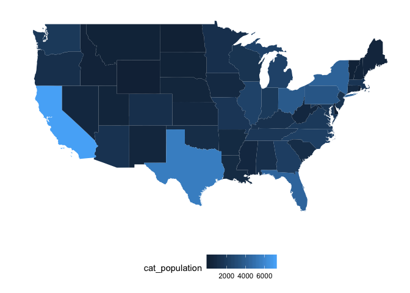
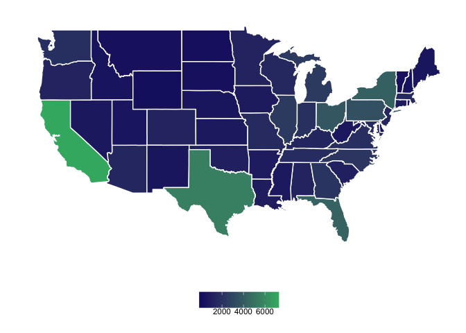
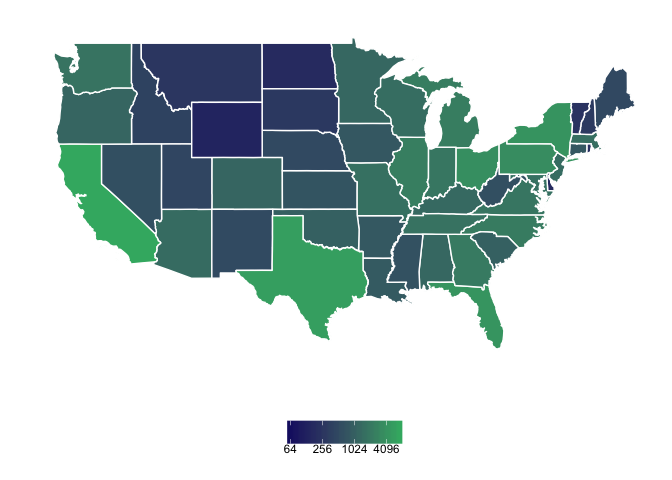

### \#TidyTuesday 9-11-18 Week 24

This week’s data explores dog & cat ownership in the US. The data can be
found
[here](https://github.com/rfordatascience/tidytuesday/blob/master/data/2018-09-11/cats_vs_dogs.csv).

We’re going to do a choropleth map. This is a map that visualizes trends
in data. For this we are going to use the tidyverse package & the
fiftystater package.

Let’s start by loading the libraries & our data. We use head() to get a
quick peek at our data & make sure it’s read in correctly.

``` r
library(fiftystater)
library(tidyverse)
```

    ## ── Attaching packages ────────────────────────────────── tidyverse 1.2.1 ──

    ## ✔ ggplot2 3.0.0     ✔ purrr   0.2.5
    ## ✔ tibble  1.4.2     ✔ dplyr   0.7.6
    ## ✔ tidyr   0.8.1     ✔ stringr 1.3.1
    ## ✔ readr   1.1.1     ✔ forcats 0.3.0

    ## Warning: package 'dplyr' was built under R version 3.5.1

    ## ── Conflicts ───────────────────────────────────── tidyverse_conflicts() ──
    ## ✖ dplyr::filter() masks stats::filter()
    ## ✖ dplyr::lag()    masks stats::lag()

``` r
data <- read_csv("cats_vs_dogs.csv", col_names = TRUE)
```

    ## Warning: Missing column names filled in: 'X1' [1]

    ## Parsed with column specification:
    ## cols(
    ##   X1 = col_integer(),
    ##   state = col_character(),
    ##   n_households = col_integer(),
    ##   percent_pet_households = col_double(),
    ##   n_pet_households = col_integer(),
    ##   percent_dog_owners = col_double(),
    ##   n_dog_households = col_integer(),
    ##   avg_dogs_per_household = col_double(),
    ##   dog_population = col_integer(),
    ##   percent_cat_owners = col_double(),
    ##   n_cat_households = col_integer(),
    ##   avg_cats_per_household = col_double(),
    ##   cat_population = col_integer()
    ## )

``` r
head(data)
```

    ## # A tibble: 6 x 13
    ##      X1 state n_households percent_pet_hou… n_pet_households
    ##   <int> <chr>        <int>            <dbl>            <int>
    ## 1     1 Alab…         1828             59.5             1088
    ## 2     2 Ariz…         2515             59.5             1497
    ## 3     3 Arka…         1148             62.4              716
    ## 4     4 Cali…        12974             52.9             6865
    ## 5     5 Colo…         1986             61.3             1217
    ## 6     6 Conn…         1337             54.4              728
    ## # ... with 8 more variables: percent_dog_owners <dbl>,
    ## #   n_dog_households <int>, avg_dogs_per_household <dbl>,
    ## #   dog_population <int>, percent_cat_owners <dbl>,
    ## #   n_cat_households <int>, avg_cats_per_household <dbl>,
    ## #   cat_population <int>

I’m partial to cats so we’re going to look at the cat population by
state. We’ll start by using select() to pick the columns we’ll need.
Part of using the fiftystater package is the state names need to be in
all lower cases. We can use mutate() & the tolower() function to make
the state names all lower case letters.

Once again, we use head() to make sure our data looks all right.

``` r
cat_data <- data %>%
  select(state, cat_population) %>%
  mutate(state = tolower(state))

head(cat_data)
```

    ## # A tibble: 6 x 2
    ##   state       cat_population
    ##   <chr>                <int>
    ## 1 alabama               1252
    ## 2 arizona               1438
    ## 3 arkansas               810
    ## 4 california            7118
    ## 5 colorado              1191
    ## 6 connecticut            796

Next, let’s make our choropleth\! The basics of this plot come from the
[fiftystater
vignette](https://cran.r-project.org/web/packages/fiftystater/vignettes/fiftystater.html).

``` r
ggplot(cat_data, aes(map_id = state)) +
  geom_map(aes(fill = cat_population), map = fifty_states) +
  expand_limits(x = fifty_states$long, y = fifty_states$lat) +
  coord_map() +
  scale_x_continuous(breaks = NULL) +
  scale_y_continuous(breaks = NULL) +
  labs(x = "", y = "") +
  theme(legend.position = "bottom",
        panel.background = element_blank())
```

<!-- -->

Not bad\! Let’s clean it up a bit.

First off, let’s change the color using scale\_fill\_gradient(). I’d
also like to change the border color of the states. To change the border
color, we can add a color call to the geom\_map() function. The key here
is to add the color outside of the aes() call.

``` r
ggplot(cat_data, aes(map_id = state)) +
  geom_map(aes(fill = cat_population), color = "white", map = fifty_states) +
  expand_limits(x = fifty_states$long, y = fifty_states$lat) +
  coord_map() +
  scale_x_continuous(breaks = NULL) +
  scale_y_continuous(breaks = NULL) +
  labs(x = "", y = "") +
  theme(legend.position = "bottom",
        legend.title = element_blank(),
        panel.background = element_blank()) +
  scale_fill_gradient(low = "midnightblue", high = "mediumseagreen")
```

<!-- -->

It’s getting better\! I’d like to change the scale of the numbers a bit
to make the differences between states more noticeable. To do this, I’m
going to take the log2 of each cat population number. This can be done
very easily by adding log2() around population in the fill call.

This creates a small issue in that now the numbers on the legend aren’t
as meaningful. We can fix this by adding in our own breaks & labels. We
can add these to the scale\_fill\_gradient() call.

I started by plotting the graphic with the original log2 scale. The
original 4 breaks were 6, 8, 10, and 12. We can still use these breaks,
we just need to change the labels. First, we set the breaks using
“breaks = c(6, 8, 10, 12)”. Then I calculated the inverse of the log
to come up with the labels. Then we can set the labels using “labels =
c(”64“,”256“,”1024“,”4096“)”.

Also, I removed the legend title in the theme() call.

``` r
ggplot(cat_data, aes(map_id = state)) +
  geom_map(aes(fill = log2(cat_population)), color = "white", map = fifty_states) +
  expand_limits(x = fifty_states$long, y = fifty_states$lat) +
  coord_map() +
  scale_x_continuous(breaks = NULL) +
  scale_y_continuous(breaks = NULL) +
  labs(x = "", y = "") +
  theme(legend.position = "bottom",
        legend.title = element_blank(),
        panel.background = element_blank()) +
  scale_fill_gradient(low = "midnightblue", high = "mediumseagreen", breaks = c(6, 8, 10, 12), labels = c("64", "256", "1024", "4096"))
```

<!-- -->

Looks good\!

Any questions or comments, you can get in touch with me via
[Twitter](https://twitter.com/sapo83).
